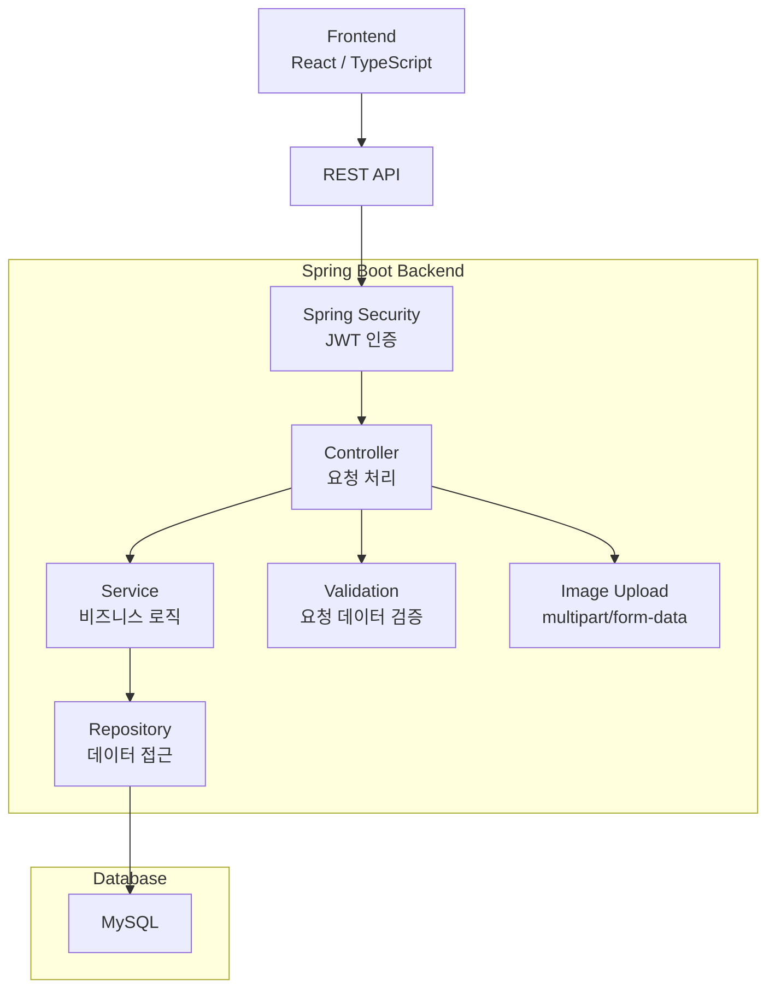

# 반띵 Backend

<p align="center">
  <strong>위치 기반 식재료 공유 플랫폼 Backend API</strong><br/>
  남는 식재료를 주변 사용자와 나누고, 거래 요청과 리뷰를 통해 신뢰 기반 공유를 지원하는 Spring Boot 서버
</p>

<p align="center">
  
  
  
  
  
  
</p>

---

## 📖 소개

**반띵**은 사용자가 보유한 식재료를 게시글로 등록하고, 주변 사용자와 나눔·판매·공동구매 형태로 거래할 수 있도록 돕는 **위치 기반 식재료 공유 플랫폼**입니다.

이 저장소는 반띵 서비스의 **Backend API 서버**입니다.
회원 인증, 게시글 관리, 댓글, 거래 요청, 리뷰, 마이페이지, 이미지 업로드 기능을 REST API로 제공합니다.

식재료 공유 서비스 특성상 단순 게시판 기능뿐만 아니라, 거래 상태 관리와 리뷰 기반 신뢰도 확인까지 고려하여 사용자가 더 안전하게 식재료를 공유할 수 있도록 설계했습니다.

---

## ✨ 주요 기능

| 기능                 | 설명                                             |
| ------------------ | ---------------------------------------------- |
| 👤 **회원가입 / 로그인**  | 이메일 기반 회원가입과 로그인 기능 제공                         |
| 🔐 **JWT 인증**      | 로그인 후 발급된 Access Token을 이용하여 인증이 필요한 API 요청 처리 |
| 📝 **게시글 CRUD**    | 식재료 나눔, 판매, 공동구매 게시글 등록·조회·수정·삭제               |
| 🔍 **게시글 검색 / 필터** | 게시글 타입, 키워드, 거리, 정렬 조건을 이용한 게시글 조회             |
| 💬 **댓글 기능**       | 게시글에 대한 문의나 소통을 위한 댓글 작성 및 조회                  |
| 🤝 **거래 요청 기능**    | 게시글에 거래 요청을 보내고, 작성자가 수락·거절·완료 처리              |
| ⭐ **리뷰 기능**        | 완료된 거래에 대해 리뷰 작성 및 사용자 평점 조회                   |
| 🙋 **마이페이지**       | 내가 작성한 게시글, 댓글, 거래 요청, 받은 거래 요청, 리뷰 정보 조회      |
| 🖼️ **이미지 업로드**    | 게시글 이미지 등록을 위한 multipart 이미지 업로드 지원            |
| 📧 **메일 설정**       | 이메일 인증 또는 알림 기능 확장을 고려한 Mail 의존성 구성            |

---

## 🎯 프로젝트 목적

반띵은 다음과 같은 문제의식에서 출발했습니다.

* 사용하지 못하고 버려지는 식재료를 줄이고 싶음
* 가까운 사용자끼리 식재료를 쉽고 빠르게 나눌 수 있는 서비스가 필요함
* 식재료 거래는 일반 물품보다 신뢰도와 상태 확인이 중요함
* 거래 이후 리뷰와 평점을 통해 안전한 거래 환경을 만들 필요가 있음

따라서 본 프로젝트는 **식재료 낭비 감소**, **지역 기반 공유 활성화**, **신뢰 기반 거래 환경 제공**을 목표로 합니다.

---

## 🏗️ Backend Architecture



---

## 🧩 시스템 구성

### Controller

클라이언트 요청을 받아 적절한 Service로 전달합니다.

주요 Controller는 다음 기능을 담당합니다.

* 인증 API
* 게시글 API
* 댓글 API
* 거래 요청 API
* 리뷰 API
* 마이페이지 API
* 이미지 업로드 API

### Service

서비스의 핵심 비즈니스 로직을 처리합니다.

예를 들어 게시글 작성 권한 확인, 거래 요청 생성, 거래 요청 수락·거절·완료 처리, 리뷰 작성 가능 여부 확인 등의 로직이 이 계층에서 수행됩니다.

### Repository

Spring Data JPA를 통해 데이터베이스에 접근합니다.

사용자, 게시글, 댓글, 거래 요청, 리뷰 등의 데이터를 MySQL에 저장하고 조회합니다.

### Security

Spring Security와 JWT를 활용하여 인증이 필요한 API를 보호합니다.

로그인 후 발급된 토큰을 `Authorization` 헤더에 포함하여 요청하면, 서버는 토큰을 검증하고 현재 로그인한 사용자를 식별합니다.

---

## 🛠️ 기술 스택

| 구분         | 기술                           |
| ---------- | ---------------------------- |
| Language   | Java 21                      |
| Framework  | Spring Boot 4.0.6            |
| Web        | Spring WebMVC                |
| Security   | Spring Security, JWT         |
| Database   | MySQL                        |
| ORM        | Spring Data JPA              |
| Validation | Spring Validation            |
| Mail       | Spring Boot Mail, Angus Mail |
| Build Tool | Gradle                       |
| Test       | JUnit Platform, H2 Database  |
| Library    | Lombok                       |

---

## 📂 프로젝트 구조

```bash
foodshare-backend/
├── docs/
│   ├── API.md                         # API 명세 문서
│   └── design/
│       └── 반띵_소프트웨어설계서.pdf     # 프로젝트 설계 문서
│
├── src/
│   ├── main/
│   │   ├── java/com/hjs/foodshare/
│   │   │   ├── auth/                  # 회원가입, 로그인, 인증 관련 기능
│   │   │   ├── post/                  # 게시글 등록, 조회, 수정, 삭제
│   │   │   ├── comment/               # 댓글 기능
│   │   │   ├── trade/                 # 거래 요청, 수락, 거절, 완료 처리
│   │   │   ├── review/                # 리뷰 작성 및 평점 조회
│   │   │   ├── mypage/                # 마이페이지 조회
│   │   │   ├── upload/                # 이미지 업로드
│   │   │   └── global/                # 공통 응답, 예외 처리, 보안 설정
│   │   │
│   │   └── resources/
│   │       └── application.properties
│   │
│   └── test/
│
├── build.gradle
├── settings.gradle
├── gradlew
├── gradlew.bat
└── README.md
```

---

## 🔐 인증 방식

반띵 Backend는 JWT 기반 인증 방식을 사용합니다.

대부분의 쓰기 API는 JWT 인증이 필요합니다.

```http
Authorization: Bearer {accessToken}
```

인증 흐름은 다음과 같습니다.

1. 사용자가 회원가입 또는 로그인을 요청합니다.
2. 서버는 사용자 정보를 확인한 뒤 Access Token을 발급합니다.
3. 클라이언트는 발급받은 토큰을 저장합니다.
4. 게시글 작성, 거래 요청, 리뷰 작성 등 인증이 필요한 API 요청 시 `Authorization` 헤더에 토큰을 포함합니다.
5. 서버는 JWT를 검증하고 현재 사용자를 식별합니다.

---

## 📌 주요 API

### Auth

| Method | URL                        | 설명                   |
| ------ | -------------------------- | -------------------- |
| POST   | `/api/auth/signup`         | 회원가입                 |
| POST   | `/api/auth/login`          | 로그인                  |
| POST   | `/api/auth/find-email`     | 이름과 전화번호를 이용한 이메일 찾기 |
| POST   | `/api/auth/reset-password` | 비밀번호 재설정             |
| GET    | `/api/auth/nickname/check` | 닉네임 중복 확인            |
| GET    | `/api/auth/email/check`    | 이메일 중복 확인            |
| GET    | `/api/auth/phone/check`    | 전화번호 중복 확인           |

---

### Posts

게시글 타입은 다음 세 가지로 구분됩니다.

| 타입          | 설명    |
| ----------- | ----- |
| `SHARE`     | 무료 나눔 |
| `SALE`      | 판매    |
| `GROUP_BUY` | 공동구매  |

| Method | URL                   | 설명        |
| ------ | --------------------- | --------- |
| POST   | `/api/posts`          | 게시글 작성    |
| GET    | `/api/posts`          | 게시글 목록 조회 |
| GET    | `/api/posts/{postId}` | 게시글 상세 조회 |
| PUT    | `/api/posts/{postId}` | 게시글 수정    |
| DELETE | `/api/posts/{postId}` | 게시글 삭제    |

게시글 목록 조회는 다음 조건을 지원합니다.

```text
postType=SHARE | SALE | GROUP_BUY
keyword=상추
maxDistanceKm=1.0
radiusKm=1.0
sort=LATEST | EXPIRING_SOON | DISTANCE
```

예시:

```http
GET /api/posts?postType=SHARE
GET /api/posts?keyword=상추
GET /api/posts?maxDistanceKm=1.0
GET /api/posts?sort=EXPIRING_SOON
GET /api/posts?postType=GROUP_BUY&keyword=양배추&sort=DISTANCE
```

---

### Comments

| Method | URL                            | 설명        |
| ------ | ------------------------------ | --------- |
| POST   | `/api/posts/{postId}/comments` | 댓글 작성     |
| GET    | `/api/posts/{postId}/comments` | 게시글 댓글 조회 |

---

### Trade Requests

| Method         | URL                                        | 설명               |
| -------------- | ------------------------------------------ | ---------------- |
| POST           | `/api/posts/{postId}/requests`             | 거래 요청 생성         |
| POST           | `/api/posts/{postId}/trade-requests`       | 거래 요청 생성         |
| GET            | `/api/posts/{postId}/trade-requests`       | 특정 게시글의 거래 요청 조회 |
| GET            | `/api/trade-requests/me`                   | 내가 보낸 거래 요청 조회   |
| GET            | `/api/trade-requests/received`             | 내가 받은 거래 요청 조회   |
| POST/PATCH/PUT | `/api/trade-requests/{requestId}/accept`   | 거래 요청 수락         |
| POST/PATCH/PUT | `/api/trade-requests/{requestId}/reject`   | 거래 요청 거절         |
| POST/PATCH/PUT | `/api/trade-requests/{requestId}/complete` | 거래 완료 처리         |

거래 요청 상태는 다음과 같습니다.

| 상태          | 설명       |
| ----------- | -------- |
| `PENDING`   | 거래 요청 대기 |
| `ACCEPTED`  | 거래 요청 수락 |
| `REJECTED`  | 거래 요청 거절 |
| `COMPLETED` | 거래 완료    |

---

### Reviews

리뷰는 거래 요청이 `COMPLETED` 상태가 된 이후 작성할 수 있습니다.
각 사용자는 하나의 거래 요청에 대해 한 번만 리뷰를 작성할 수 있습니다.

| Method | URL                                       | 설명              |
| ------ | ----------------------------------------- | --------------- |
| POST   | `/api/trade-requests/{requestId}/reviews` | 리뷰 작성           |
| GET    | `/api/users/{userId}/reviews`             | 특정 사용자 리뷰 조회    |
| GET    | `/api/users/{userId}/rating`              | 특정 사용자 평점 요약 조회 |
| GET    | `/api/mypage/reviews`                     | 내가 작성한 리뷰 조회    |

---

### My Page

마이페이지 관련 API는 모두 JWT 인증이 필요합니다.

| Method | URL                                   | 설명             |
| ------ | ------------------------------------- | -------------- |
| GET    | `/api/mypage`                         | 내 정보 요약 조회     |
| GET    | `/api/mypage/posts`                   | 내가 작성한 게시글 조회  |
| GET    | `/api/mypage/comments`                | 내가 작성한 댓글 조회   |
| GET    | `/api/mypage/trade-requests`          | 내가 보낸 거래 요청 조회 |
| GET    | `/api/mypage/received-trade-requests` | 내가 받은 거래 요청 조회 |

---

### Image Upload

게시글 이미지 등록을 위한 이미지 업로드 API입니다.

| Method | URL                   | 설명      |
| ------ | --------------------- | ------- |
| POST   | `/api/uploads/images` | 이미지 업로드 |

지원 파일 형식:

```text
image/jpeg
image/png
image/webp
image/gif
```

최대 파일 크기:

```text
5MB
```

업로드 성공 시 반환되는 `imageUrl`을 게시글 작성 또는 수정 요청의 `imageUrl` 값으로 사용할 수 있습니다.

---

## 🗃️ 주요 데이터

반띵 Backend는 다음 데이터를 중심으로 동작합니다.

| 데이터          | 설명                                             |
| ------------ | ---------------------------------------------- |
| User         | 회원 정보, 이메일, 비밀번호, 닉네임, 전화번호, 위치 정보             |
| Post         | 식재료 게시글, 게시글 타입, 제목, 식재료명, 수량, 가격, 거래 위치, 유통기한 |
| Comment      | 게시글 댓글 정보                                      |
| TradeRequest | 거래 요청 정보, 요청자, 게시글, 거래 상태                      |
| Review       | 거래 완료 후 작성되는 리뷰와 평점                            |
| Upload       | 게시글 이미지 파일 정보                                  |

---

## 🚀 시작하기

### 사전 요구사항

* Java 21
* MySQL
* Gradle 또는 프로젝트에 포함된 Gradle Wrapper

---

### 1. 저장소 클론

```bash
git clone https://github.com/hjs7115/foodshare-backend.git
cd foodshare-backend
```

---

### 2. 로컬 설정 파일 생성

로컬 환경의 DB 비밀번호, JWT Secret, 메일 계정 정보는 GitHub에 올리지 않습니다.

프로젝트 루트에 `application-local.properties` 파일을 생성하고 아래 값을 설정합니다.

```properties
spring.datasource.url=jdbc:mysql://localhost:3306/foodshare?serverTimezone=Asia/Seoul&characterEncoding=UTF-8
spring.datasource.username=root
spring.datasource.password=your-password

app.jwt.secret=replace-with-a-long-random-secret

MAIL_USERNAME=your-email@example.com
MAIL_PASSWORD=your-mail-password
```

---

### 3. 서버 실행

Windows 환경:

```powershell
.\gradlew.bat bootRun
```

macOS / Linux 환경:

```bash
./gradlew bootRun
```

서버 실행 후 기본 주소는 다음과 같습니다.

```text
http://localhost:8080
```

---

## 🧪 API 테스트 예시

### 회원가입

```http
POST /api/auth/signup
Content-Type: application/json
```

```json
{
  "name": "허준서",
  "nickname": "junseo",
  "email": "test@email.com",
  "password": "password123",
  "carrier": "SKT",
  "phoneNumber": "01012345678",
  "location": "충북 충주시"
}
```

---

### 로그인

```http
POST /api/auth/login
Content-Type: application/json
```

```json
{
  "email": "test@email.com",
  "password": "password123"
}
```

로그인 성공 후 응답으로 받은 `accessToken`을 저장한 뒤, 인증이 필요한 API 요청에 사용합니다.

---

### 게시글 작성

```http
POST /api/posts
Content-Type: application/json
Authorization: Bearer {accessToken}
```

```json
{
  "postType": "SHARE",
  "title": "상추 나눔",
  "ingredientName": "상추",
  "quantity": "300g",
  "price": 0,
  "tradeLocation": "충북 충주시",
  "distanceKm": 0.5,
  "expirationDate": "2026-05-20",
  "imageUrl": "/uploads/example.png",
  "content": "상추 나눔합니다."
}
```

---

### 이미지 업로드

```http
POST /api/uploads/images
Content-Type: multipart/form-data
Authorization: Bearer {accessToken}
```

Form field:

```text
file
```

---

## 📄 문서

API 문서는 아래 파일에서 확인할 수 있습니다.

```bash
docs/API.md
```

설계 문서는 아래 경로에 포함되어 있습니다.

```bash
docs/design/반띵_소프트웨어설계서.pdf
```

---

## 🔄 개발 진행 상태

현재 Backend는 핵심 API 구현과 프론트엔드 연동을 중심으로 개발되었습니다.

* 회원가입 / 로그인
* JWT 기반 인증
* 게시글 CRUD
* 게시글 검색 및 필터링
* 댓글 작성 및 조회
* 거래 요청 생성
* 거래 요청 수락 / 거절 / 완료
* 완료된 거래 기반 리뷰 작성
* 사용자 리뷰 및 평점 조회
* 마이페이지 조회
* 이미지 업로드

아직 실제 서비스 운영 결과나 사용자 통계는 확보되지 않았기 때문에, README에는 운영 결과 지표를 포함하지 않았습니다.

---

## 👥 팀원

| 이름  | 역할                           |
| --- | ---------------------------- |
| 허준서 | Backend 개발, API 구현, 문서 정리    |
| 강신혁 | Frontend / Backend 개발, 설계 보완 |

---

## 📌 향후 개선 방향

* 이메일 인증 기능 고도화
* 알림 기능 추가
* 이미지 저장 방식 개선
* 위치 기반 거리 계산 기능 강화
* 거래 상태 변경 시 사용자 알림 제공
* 리뷰 기반 신뢰도 / 신선도 점수 시각화
* 예외 처리 및 테스트 코드 보강
* 배포 환경 구성

---

## 📚 프로젝트 의의

반띵 Backend는 단순 게시판 API가 아니라, 식재료 공유 서비스에 필요한 **회원 인증**, **게시글 관리**, **거래 요청**, **리뷰**, **마이페이지**, **이미지 업로드** 기능을 통합한 서버입니다.

이를 통해 Spring Boot 기반 REST API 설계, JWT 인증, JPA를 활용한 데이터 관리, 프론트엔드와의 API 연동 흐름을 경험할 수 있었습니다.

또한 식재료 공유라는 서비스 특성을 고려하여 거래 상태와 리뷰 구조를 함께 설계하면서, 실제 사용자 흐름에 가까운 백엔드 구조를 구현하는 데 초점을 맞췄습니다.
