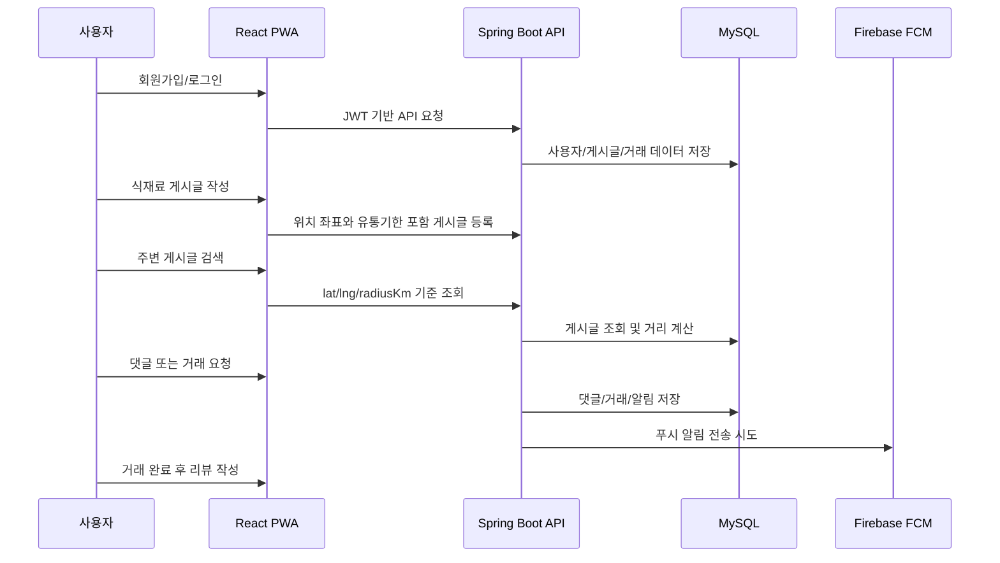

# 반띵 FoodShare

<p align="center">
  
</p>

<p align="center">
  <strong>위치 기반 식재료 공유 플랫폼</strong><br/>
  남는 식재료를 주변 이웃과 나누고, 판매하고, 공동구매할 수 있는 웹/PWA 서비스입니다.
</p>

<p align="center">
  
  
  
  
  
  
  
  
</p>

---

## 프로젝트 소개

반띵은 유통기한이 얼마 남지 않았거나 혼자 쓰기 많은 식재료를 가까운 사용자와 공유하기 위한 서비스입니다.
사용자는 식재료 게시글을 작성하고, 주변 게시글을 위치와 거리 기준으로 찾고, 댓글과 거래 요청을 통해 나눔/판매/공동구매에 참여할 수 있습니다.

식재료 거래 특성상 위치, 유통기한, 신뢰도, 알림이 중요하기 때문에 백엔드는 JWT 인증, 이메일 인증, 위치 기반 검색, 거래 요청, 리뷰/평점, DB 알림, FCM 푸시, 신고/차단, 배지/업적 기능을 제공합니다.

## 주요 기능

| 구분 | 기능 |
| --- | --- |
| 인증 | 회원가입, 로그인, 이메일 인증, 비밀번호 찾기 이메일 코드 인증, 중복 확인 |
| 게시글 | 나눔/판매/공동구매 게시글 CRUD, 이미지 업로드, 유통기한 저장 |
| 위치 검색 | 게시글 좌표 저장, 요청자 좌표 기준 Haversine 거리 계산, 반경 필터링, 거리 정렬 |
| 공동구매 | 목표 인원, 현재 인원, 마감일 관리, 정원 도달 시 자동 마감 |
| 댓글 | 게시글 댓글 작성/조회/수정/삭제, 댓글 알림 생성 |
| 관심 게시글 | 관심 등록/해제/상태 조회, 마이페이지 관심 목록 |
| 거래 요청 | 요청, 수락, 거절, 완료 처리, 일반 거래 마감 및 공동구매 참여 인원 반영 |
| 리뷰/평점 | 완료된 거래 기반 리뷰 작성, 사용자 평점/리뷰 조회 |
| 알림 | DB 알림 목록/읽음 처리, FCM 토큰 저장, 테스트 푸시, 유통기한 임박 배치 알림 |
| 신고/차단 | 사용자/게시글/댓글 신고, 사용자 차단/해제, 차단 사용자 콘텐츠 숨김 및 거래/댓글 제한 |
| 배지/업적 | 게시글 작성, 나눔, 공동구매, 거래 완료, 리뷰, 평점 기반 배지 진행률 계산 |
| PWA | 웹앱 설치, 서비스 워커, 웹 푸시 알림 연동 |

## 서비스 흐름



## 기술 스택

| 영역 | 기술 |
| --- | --- |
| Frontend | React 18, TypeScript, Vite |
| UI | MUI, Radix UI, Lucide React, Motion |
| PWA/Push | Service Worker, Web Push, Firebase Cloud Messaging |
| Backend | Java 21, Spring Boot |
| Security | Spring Security, JWT, BCrypt |
| Database | MySQL, H2 Test DB |
| ORM | Spring Data JPA, Hibernate |
| Validation | Jakarta Validation |
| Mail | Spring Boot Mail, SMTP |
| Build/Test | Gradle, npm, JUnit |

## 프로젝트 구조

```text
foodshare/
├─ docs/                         # API 문서, 설계 이미지
├─ public/                       # 프론트 정적 리소스, PWA manifest/service worker
├─ src/
│  ├─ app/                       # React 화면, 컴포넌트, API 클라이언트
│  ├─ styles/                    # 프론트 스타일
│  ├─ main/                      # Spring Boot 백엔드
│  │  ├─ java/com/hjs/foodshare/
│  │  │  ├─ auth/                # 인증, 이메일 인증, 비밀번호 재설정
│  │  │  ├─ post/                # 게시글, 위치 기반 검색
│  │  │  ├─ comment/             # 댓글
│  │  │  ├─ favorite/            # 관심 게시글
│  │  │  ├─ trade/               # 거래 요청
│  │  │  ├─ review/              # 리뷰/평점
│  │  │  ├─ notification/        # DB 알림, FCM, 유통기한 알림 배치
│  │  │  ├─ moderation/          # 신고/차단
│  │  │  ├─ badge/               # 배지/업적
│  │  │  ├─ mypage/              # 마이페이지
│  │  │  ├─ upload/              # 이미지 업로드
│  │  │  └─ global/              # 공통 응답, 예외, 보안 설정
│  │  └─ resources/
│  └─ test/                      # 백엔드 테스트
├─ build.gradle                  # 백엔드 빌드 설정
├─ package.json                  # 프론트 빌드 설정
└─ README.md
```

## 실행 방법

### 1. 백엔드 실행

MySQL 데이터베이스를 준비한 뒤 로컬 설정 파일에 DB, 메일, Firebase 값을 넣습니다.
민감한 키 파일과 로컬 설정은 Git에 올리지 않습니다.

```bash
./gradlew bootRun
```

Windows PowerShell:

```powershell
.\gradlew.bat bootRun
```

기본 서버 주소:

```text
http://localhost:8080
```

### 2. 프론트엔드 실행

```bash
npm install
npm run dev
```

기본 개발 서버 주소:

```text
http://localhost:5173
```

### 3. 테스트

```powershell
.\gradlew.bat test --rerun-tasks
npm run build
```

## 주요 API

자세한 내용은 [docs/API.md](docs/API.md)를 확인합니다.

| 기능 | API |
| --- | --- |
| 회원가입 | `POST /api/auth/signup` |
| 로그인 | `POST /api/auth/login` |
| 이메일 인증 코드 발송 | `POST /api/auth/email-verifications` |
| 이메일 인증 코드 확인 | `POST /api/auth/email-verifications/verify` |
| 비밀번호 재설정 코드 발송 | `POST /api/auth/password-reset-link` |
| 비밀번호 재설정 | `POST /api/auth/reset-password` |
| 게시글 목록/검색 | `GET /api/posts?lat=&lng=&radiusKm=&sort=` |
| 게시글 작성 | `POST /api/posts` |
| 댓글 목록/작성 | `GET/POST /api/posts/{postId}/comments` |
| 거래 요청 | `POST /api/posts/{postId}/requests` |
| 거래 수락/거절/완료 | `PATCH /api/trade-requests/{requestId}/accept|reject|complete` |
| 알림 목록 | `GET /api/notifications` |
| FCM 토큰 저장 | `POST /api/notifications/fcm-token` |
| 신고 | `POST /api/reports` |
| 차단/해제 | `POST/DELETE /api/users/{userId}/block` |
| 배지/업적 | `GET /api/badges/me` |
| 마이페이지 | `GET /api/mypage` |

## 데이터 모델 요약

| 엔티티 | 설명 |
| --- | --- |
| `User` | 회원 정보, 위치, 알림 설정, FCM 토큰 |
| `Post` | 식재료 게시글, 위치 좌표, 유통기한, 공동구매 정보 |
| `Comment` | 게시글 댓글 |
| `Favorite` | 관심 게시글 |
| `TradeRequest` | 거래 요청과 상태 |
| `Review` | 완료 거래 기반 리뷰와 평점 |
| `Notification` | 사용자별 DB 알림 |
| `EmailVerification` | 이메일 인증/비밀번호 재설정 코드 |
| `Report` | 사용자/게시글/댓글 신고 내역 |
| `UserBlock` | 사용자 차단 관계 |

## 현재 구현 상태

- 백엔드 주요 테스트 통과: 인증 보안 흐름, 위치 검색, 알림, 공동구매, 신고/차단, 배지 계산
- MySQL 연결 및 JPA 스키마 반영 확인
- PWA/FCM은 웹 기준으로 구성
- 프론트와 백엔드 API 연동을 위한 호환 엔드포인트 일부 유지

## 저장소

- 통합본: https://github.com/hjs7115/foodshare
- 프론트엔드: https://github.com/hjs7115/foodshare-frontend
- 백엔드: https://github.com/hjs7115/foodshare-backend
