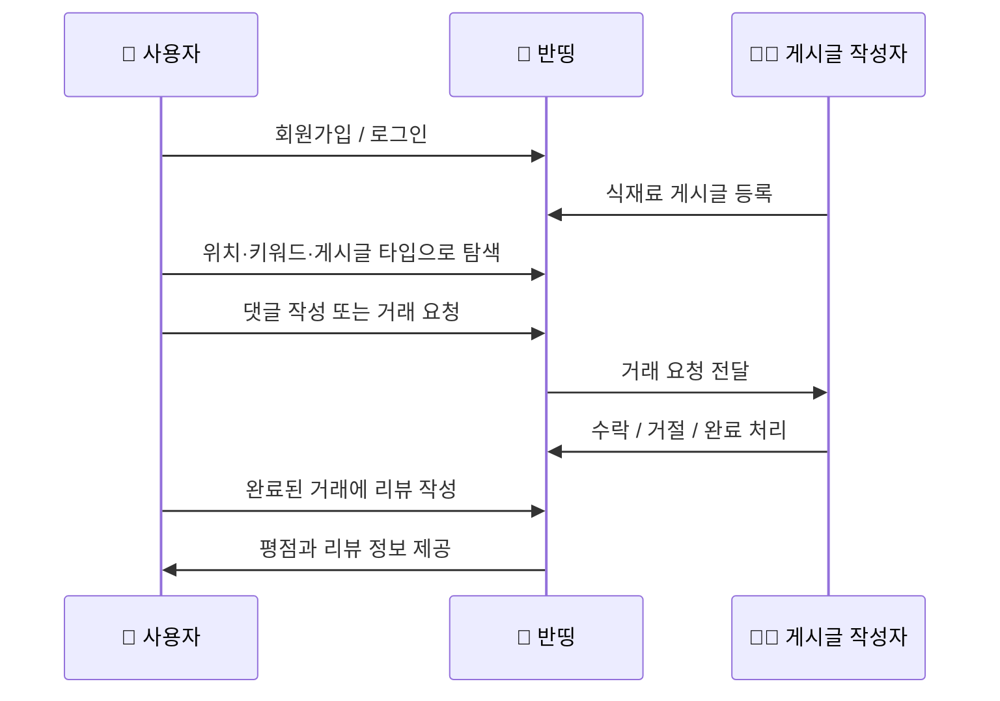
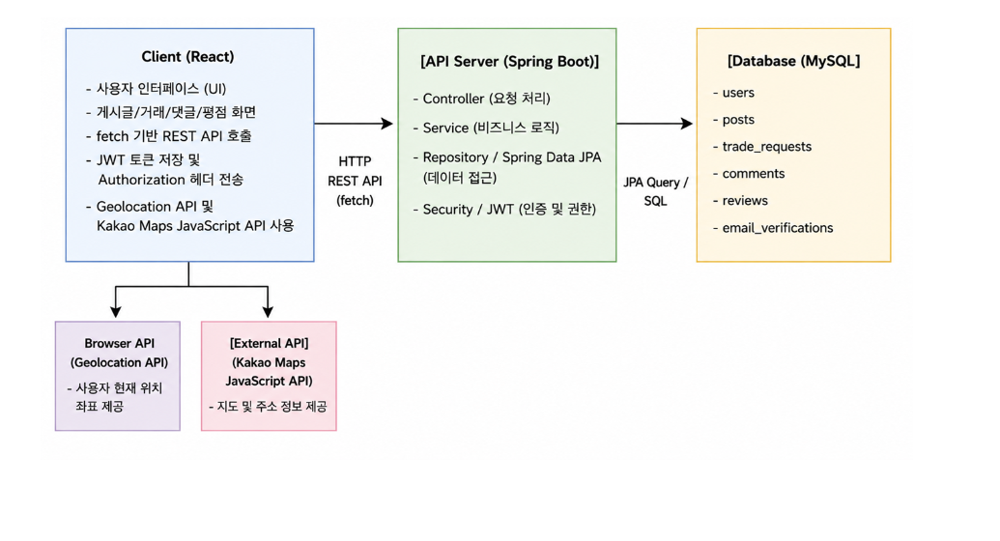
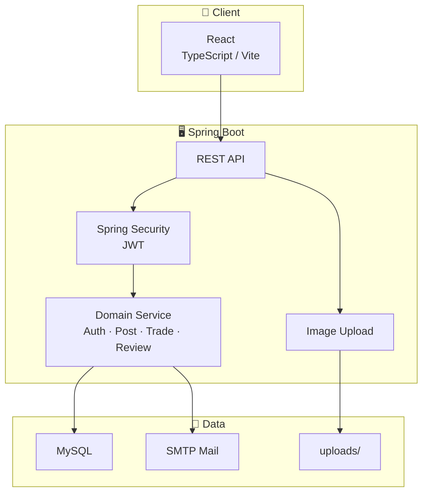
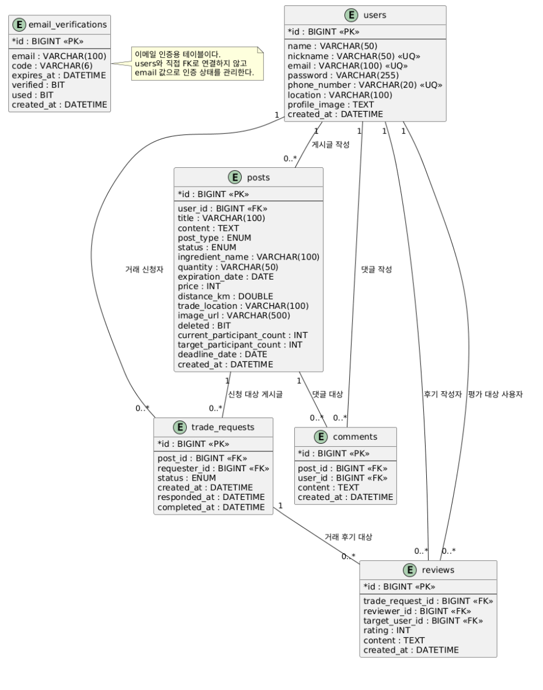

# 반띵
<p align="center">
  
</p>

<p align="center">
  <strong>위치 기반 식재료 공유 플랫폼</strong><br/>
  남는 식재료를 주변 사용자와 나누고, 공동구매·거래 요청·리뷰를 통해 신뢰 기반 공유를 지원하는 서비스
</p>

<p align="center">
  
  
  
  
  
  
  
  
</p>

---


## 📖 소개

**반띵**은 혼자 쓰기엔 많고 버리기엔 아까운 식재료를 가까운 이웃과 나눌 수 있도록 돕는 **위치 기반 식재료 공유 플랫폼**입니다.

사용자는 보유한 식재료를 나눔·판매·공동구매 게시글로 등록하고, 주변 사용자는 게시글을 탐색한 뒤 댓글이나 거래 요청을 통해 공유에 참여할 수 있습니다.

식재료는 일반 중고 물품보다 신선도, 유통기한, 거래 위치, 사용자 신뢰도가 중요하기 때문에 반띵은 게시글 작성부터 거래 완료, 리뷰와 평점까지 이어지는 흐름을 하나의 서비스 경험으로 설계했습니다.

### ✨ 주요 특징

| 기능 | 설명 |
|------|------|
| 📍 **위치 기반 탐색** | 사용자 위치와 거리 조건을 기준으로 주변 식재료 게시글 조회 |
| 🥬 **식재료 게시판** | 나눔, 판매, 공동구매 목적에 맞춰 식재료 게시글 등록·수정·삭제 |
| 🛒 **공동구매 모집** | 목표 인원과 마감일을 설정해 함께 구매할 이웃 모집 |
| 🔍 **검색과 필터링** | 게시글 타입, 키워드, 거리, 유통기한 임박순 등 조건별 조회 |
| 💬 **댓글 소통** | 게시글에 대한 문의와 거래 전 소통을 위한 댓글 기능 |
| 🤝 **거래 요청** | 관심 있는 게시글에 거래 요청을 보내고 작성자가 수락·거절·완료 처리 |
| ⭐ **리뷰와 평점** | 완료된 거래를 기반으로 리뷰를 작성하고 사용자 신뢰도 확인 |
| ❤️ **관심 게시글** | 다시 보고 싶은 게시글을 관심 목록으로 저장 |
| 🔔 **알림 설정** | 거래와 서비스 알림을 위한 설정 및 알림 목록 관리 |
| 🔐 **회원 인증** | JWT 기반 로그인, 이메일 인증, 닉네임·이메일·전화번호 중복 확인 제공 |
| 🖼️ **이미지 업로드** | 식재료 상태를 확인할 수 있도록 게시글 이미지 업로드 지원 |

---

## 🎯 기획 배경

반띵은 다음 문제의식에서 출발했습니다.

- 냉장고에 남아 있는 식재료가 사용되지 못하고 버려지는 경우가 많음
- 필요한 양보다 많이 사야 하는 식재료를 이웃과 나누거나 공동구매할 수 있는 방법이 필요함
- 식재료 공유는 가까운 거리에서 빠르게 이루어지는 것이 중요함
- 유통기한과 상태 확인이 필요한 만큼 거래 전후의 신뢰 장치가 필요함

따라서 반띵은 **식재료 낭비 감소**, **지역 기반 공유 활성화**, **신뢰 기반 거래 환경 제공**을 목표로 합니다.

---

## 🧭 서비스 흐름



---

## 🏗️ 아키텍처





---

## 🧩 핵심 도메인

### 👤 사용자

이메일, 비밀번호, 닉네임, 전화번호, 위치 정보를 기반으로 회원을 관리합니다.

로그인 이후 발급되는 JWT를 통해 게시글 작성, 거래 요청, 리뷰 작성, 마이페이지 조회처럼 인증이 필요한 기능을 사용할 수 있습니다.

### 🥬 게시글

게시글은 식재료 공유 목적에 따라 `SHARE`, `SALE`, `GROUP_BUY`로 구분됩니다.

식재료명, 수량, 가격, 거래 위치, 거리, 유통기한, 이미지, 상세 설명을 함께 저장하여 사용자가 식재료 상태와 거래 조건을 확인할 수 있도록 구성했습니다.

| 타입 | 설명 |
|------|------|
| `SHARE` | 무료 나눔 |
| `SALE` | 판매 |
| `GROUP_BUY` | 공동구매 |

### 💬 댓글

게시글 상세 화면에서 문의나 거래 전 확인이 필요한 내용을 댓글로 주고받을 수 있습니다.

작성자는 자신의 댓글을 수정하거나 삭제할 수 있습니다.

### 🛒 공동구매

공동구매 게시글은 `GROUP_BUY` 타입으로 등록되며, 일반 나눔·판매 게시글과 달리 목표 인원과 마감일 정보를 함께 관리합니다.

사용자는 공동구매 게시판에서 진행 중인 모집글을 확인하고, 거래 요청을 통해 참여 의사를 전달할 수 있습니다.

| 항목 | 설명 |
|------|------|
| 목표 인원 | 공동구매 모집에 필요한 전체 참여 인원 |
| 현재 참여 인원 | 현재까지 참여한 사용자 수 |
| 마감일 | 공동구매 모집을 종료할 날짜 |

### 🤝 거래 요청

사용자는 원하는 게시글에 거래 요청을 보낼 수 있고, 게시글 작성자는 요청을 수락·거절·완료 처리할 수 있습니다.

| 상태 | 설명 |
|------|------|
| `PENDING` | 거래 요청 대기 |
| `ACCEPTED` | 거래 요청 수락 |
| `REJECTED` | 거래 요청 거절 |
| `COMPLETED` | 거래 완료 |

### ⭐ 리뷰

거래가 완료된 뒤에는 상대 사용자에 대한 리뷰와 평점을 남길 수 있습니다.

리뷰는 거래 이후의 신뢰 정보를 쌓기 위한 장치이며, 사용자는 다른 사용자의 평점과 리뷰 목록을 조회할 수 있습니다.

---

## 📊 데이터 설계



| 데이터 | 설명 |
|------|------|
| `User` | 회원 정보, 이메일, 닉네임, 전화번호, 위치 정보 |
| `Post` | 식재료 게시글, 게시글 타입, 거래 조건, 유통기한, 이미지 |
| `Comment` | 게시글 댓글 |
| `Favorite` | 사용자가 관심 등록한 게시글 |
| `TradeRequest` | 게시글 거래 요청과 거래 상태 |
| `Review` | 거래 완료 후 작성되는 리뷰와 평점 |
| `EmailVerification` | 이메일 인증 코드와 검증 상태 |

---

## 📂 프로젝트 구조

```bash
foodshare/
├── docs/
│   ├── API.md                         # API 명세 문서
│   ├── images/                        # 설계 이미지
│   └── design/                        # 소프트웨어 설계서
│
├── public/
│   └── assets/                        # 정적 이미지 자산
│
├── src/
│   ├── app/                           # React 화면, 컴포넌트, API 클라이언트
│   │   ├── api/
│   │   └── components/
│   │       ├── auth/                  # 로그인, 회원가입, 아이디/비밀번호 찾기
│   │       ├── board/                 # 게시판, 게시글 작성, 상세 화면
│   │       ├── category/              # 카테고리 선택
│   │       ├── common/
│   │       └── profile/               # 마이페이지, 관심 목록, 설정
│   │
│   ├── styles/                        # 프론트엔드 스타일
│   ├── main.tsx                       # 프론트엔드 진입점
│   │
│   ├── main/
│   │   ├── java/com/hjs/foodshare/
│   │   │   ├── auth/                  # 회원가입, 로그인, 인증
│   │   │   ├── post/                  # 게시글
│   │   │   ├── comment/               # 댓글
│   │   │   ├── favorite/              # 관심 게시글
│   │   │   ├── trade/                 # 거래 요청
│   │   │   ├── review/                # 리뷰
│   │   │   ├── mypage/                # 마이페이지
│   │   │   ├── notification/          # 알림
│   │   │   ├── upload/                # 이미지 업로드
│   │   │   └── global/                # 공통 응답, 예외, 보안
│   │   └── resources/
│   │       └── application.yml
│   │
│   └── test/                          # 서버 테스트
│
├── package.json                       # 프론트엔드 실행 / 빌드
├── build.gradle                       # 서버 실행 / 빌드
├── gradlew
├── gradlew.bat
└── README.md
```

---

## 🛠️ 기술 스택

| 구분 | 기술 |
|------|------|
| Frontend | React 18, TypeScript, Vite 6 |
| UI | MUI, Radix UI, Lucide React, Motion |
| Backend | Java 21, Spring Boot 4.0.6 |
| Web | Spring Web MVC |
| Security | Spring Security, JWT, BCrypt |
| Database | MySQL |
| ORM | Spring Data JPA, Hibernate |
| Validation | Jakarta Validation |
| Mail | Spring Boot Mail, Angus Mail |
| Build | Gradle, npm |
| Test | JUnit Platform, H2 Database |
| Library | Lombok |

---

## 🔐 인증 방식

반띵은 JWT 기반 인증 방식을 사용합니다.

로그인 성공 시 발급된 Access Token을 인증이 필요한 요청의 `Authorization` 헤더에 포함합니다.

```http
Authorization: Bearer {accessToken}
```

인증 흐름은 다음과 같습니다.

1. 사용자가 회원가입 또는 로그인을 요청합니다.
2. 서버는 사용자 정보를 검증한 뒤 Access Token을 발급합니다.
3. 클라이언트는 토큰을 저장합니다.
4. 게시글 작성, 거래 요청, 리뷰 작성 등 인증이 필요한 API 요청에 토큰을 포함합니다.
5. 서버는 JWT를 검증하고 현재 로그인한 사용자를 식별합니다.

---

## 📌 주요 API

### Auth

| Method | URL | 설명 |
|------|------|------|
| POST | `/api/auth/signup` | 회원가입 |
| POST | `/api/auth/login` | 로그인 |
| POST | `/api/auth/logout` | 로그아웃 |
| POST | `/api/auth/find-email` | 이메일 찾기 |
| POST | `/api/auth/find-id` | 아이디 찾기 |
| POST | `/api/auth/password-reset-link` | 비밀번호 재설정 링크 생성 |
| POST | `/api/auth/reset-password` | 비밀번호 재설정 |
| GET | `/api/auth/nickname/check` | 닉네임 중복 확인 |
| GET | `/api/auth/email/check` | 이메일 중복 확인 |
| GET | `/api/auth/phone/check` | 전화번호 중복 확인 |
| POST | `/api/auth/email-verifications` | 이메일 인증번호 발송 |
| POST | `/api/auth/email-verifications/verify` | 이메일 인증번호 검증 |

### Posts

| Method | URL | 설명 |
|------|------|------|
| POST | `/api/posts` | 게시글 작성 |
| POST | `/api/posts/create` | 게시글 작성 |
| GET | `/api/posts` | 게시글 목록 조회 |
| GET | `/api/posts/{postId}` | 게시글 상세 조회 |
| PUT | `/api/posts/{postId}` | 게시글 수정 |
| DELETE | `/api/posts/{postId}` | 게시글 삭제 |

게시글 타입은 다음 세 가지로 구분됩니다.

| 타입 | 설명 |
|------|------|
| `SHARE` | 무료 나눔 |
| `SALE` | 판매 |
| `GROUP_BUY` | 공동구매 |

게시글 목록 조회는 다음 조건을 지원합니다.

```text
postType=SHARE | SALE | GROUP_BUY
keyword=상추
maxDistanceKm=1.0
radiusKm=1.0
sort=LATEST | EXPIRING_SOON | DISTANCE
```

### Comments

| Method | URL | 설명 |
|------|------|------|
| POST | `/api/posts/{postId}/comments` | 댓글 작성 |
| GET | `/api/posts/{postId}/comments` | 게시글 댓글 조회 |
| PUT | `/api/comments/{commentId}` | 댓글 수정 |
| DELETE | `/api/comments/{commentId}` | 댓글 삭제 |

### Favorites

| Method | URL | 설명 |
|------|------|------|
| POST | `/api/posts/{postId}/favorite` | 관심 게시글 등록 |
| DELETE | `/api/posts/{postId}/favorite` | 관심 게시글 해제 |
| GET | `/api/posts/{postId}/favorite` | 관심 여부 조회 |
| GET | `/api/favorites` | 내 관심 게시글 조회 |

### Trade Requests

| Method | URL | 설명 |
|------|------|------|
| POST | `/api/posts/{postId}/requests` | 거래 요청 생성 |
| POST | `/api/posts/{postId}/trade-requests` | 거래 요청 생성 |
| GET | `/api/posts/{postId}/trade-requests` | 특정 게시글의 거래 요청 조회 |
| GET | `/api/trade-requests/me` | 내가 보낸 거래 요청 조회 |
| GET | `/api/trade-requests/received` | 내가 받은 거래 요청 조회 |
| POST/PATCH/PUT | `/api/trade-requests/{requestId}/accept` | 거래 요청 수락 |
| POST/PATCH/PUT | `/api/trade-requests/{requestId}/reject` | 거래 요청 거절 |
| POST/PATCH/PUT | `/api/trade-requests/{requestId}/complete` | 거래 완료 처리 |

### Reviews

| Method | URL | 설명 |
|------|------|------|
| POST | `/api/trade-requests/{requestId}/reviews` | 거래 요청 기반 리뷰 작성 |
| POST | `/api/users/{userId}/reviews` | 특정 사용자 대상 리뷰 작성 |
| GET | `/api/users/{userId}/reviews` | 특정 사용자 리뷰 조회 |
| GET | `/api/users/{userId}/rating` | 특정 사용자 평점 요약 조회 |
| GET | `/api/mypage/reviews` | 내가 작성한 리뷰 조회 |

### My Page

| Method | URL | 설명 |
|------|------|------|
| GET | `/api/mypage` | 내 정보 요약 조회 |
| GET | `/api/mypage/posts` | 내가 작성한 게시글 조회 |
| GET | `/api/mypage/comments` | 내가 작성한 댓글 조회 |
| GET | `/api/mypage/trade-requests` | 내가 보낸 거래 요청 조회 |
| GET | `/api/mypage/received-trade-requests` | 내가 받은 거래 요청 조회 |
| PUT | `/api/mypage` | 프로필 수정 |
| PUT | `/api/mypage/location` | 위치 수정 |

### Notifications

| Method | URL | 설명 |
|------|------|------|
| GET | `/api/mypage/notifications/settings` | 알림 설정 조회 |
| PUT | `/api/mypage/notifications/settings` | 알림 설정 수정 |
| GET | `/api/notifications` | 알림 목록 조회 |
| POST/PUT/PATCH | `/api/notifications/{notificationId}/read` | 알림 읽음 처리 |
| POST | `/api/notifications/fcm-token` | FCM 토큰 등록 |

### Image Upload

| Method | URL | 설명 |
|------|------|------|
| POST | `/api/uploads/images` | 이미지 업로드 |

지원 파일 형식은 `image/jpeg`, `image/png`, `image/webp`, `image/gif`이며 최대 파일 크기는 `5MB`입니다.

---

## 🚀 시작하기

### 사전 요구사항

- Java 21
- MySQL
- Node.js / npm
- Gradle 또는 프로젝트에 포함된 Gradle Wrapper

### 1. 저장소 클론

```bash
git clone https://github.com/hjs7115/foodshare.git
cd foodshare
```

### 2. 로컬 설정 파일 생성

프로젝트 루트에 `application-local.properties` 파일을 생성하고 로컬 환경 값을 설정합니다.

```properties
spring.datasource.url=jdbc:mysql://localhost:3306/foodshare?serverTimezone=Asia/Seoul&characterEncoding=UTF-8
spring.datasource.username=root
spring.datasource.password=your-password

app.jwt.secret=replace-with-a-long-random-secret

MAIL_USERNAME=your-email@example.com
MAIL_PASSWORD=your-mail-password
MAIL_FROM=your-email@example.com
```

### 3. 서버 실행

```powershell
.\gradlew.bat bootRun
```

macOS / Linux 환경에서는 다음 명령을 사용할 수 있습니다.

```bash
./gradlew bootRun
```

서버 기본 주소는 다음과 같습니다.

```text
http://localhost:8080
```

### 4. 프론트엔드 실행

```powershell
npm install
npm run dev
```

프론트엔드 개발 서버 기본 주소는 다음과 같습니다.

```text
http://localhost:5173
```

---

## 🧪 API 테스트 예시

### 회원가입

```http
POST /api/auth/signup
Content-Type: application/json
```

```json
{
  "name": "홍길동",
  "nickname": "gildong",
  "email": "test@email.com",
  "password": "password123",
  "phoneNumber": "01012345678",
  "location": "경기도 수원시"
}
```

### 로그인

```http
POST /api/auth/login
Content-Type: application/json
```

```json
{
  "email": "test@email.com",
  "password": "password123"
}
```

### 게시글 작성

```http
POST /api/posts
Content-Type: application/json
Authorization: Bearer {accessToken}
```

```json
{
  "postType": "SHARE",
  "title": "상추 나눔",
  "ingredientName": "상추",
  "quantity": "300g",
  "price": 0,
  "tradeLocation": "충북 충주시",
  "distanceKm": 0.5,
  "expirationDate": "2026-05-20",
  "imageUrl": "/uploads/example.png",
  "content": "상추 나눔합니다."
}
```

### 이미지 업로드

```http
POST /api/uploads/images
Content-Type: multipart/form-data
Authorization: Bearer {accessToken}
```

Form field:

```text
file
```

---

## 📄 문서

| 문서 | 설명 |
|------|------|
| `docs/API.md` | API 명세 |
| `docs/design/` | 소프트웨어 설계서 |
| `docs/images/system_architecture_diagram.png` | 시스템 아키텍처 |
| `docs/images/erd_diagram.png` | ERD |
| `docs/images/trade_sequence_diagram.png` | 거래 요청 시퀀스 |

---

## 🔄 개발 진행 상태

현재 반띵은 핵심 기능 구현과 화면 연동을 중심으로 개발되었습니다.

- 회원가입 / 로그인
- JWT 기반 인증
- 이메일 인증
- 게시글 CRUD
- 게시글 검색 및 필터링
- 댓글 작성 / 조회 / 수정 / 삭제
- 관심 게시글 등록 / 해제 / 조회
- 거래 요청 생성
- 거래 요청 수락 / 거절 / 완료
- 완료된 거래 기반 리뷰 작성
- 사용자 리뷰 및 평점 조회
- 마이페이지 조회 및 프로필·위치 수정
- 알림 설정 및 FCM 토큰 등록 API
- 이미지 업로드
- React 기반 사용자 화면 구성

아직 실제 서비스 운영 결과나 사용자 통계는 확보되지 않았기 때문에 운영 성과 지표는 포함하지 않았습니다.

---

## 👥 팀원

| 이름 | 역할 |
|------|------|
| 허준서 | PM / 서버 개발, DB 설계, API 구현, 문서 정리 |
| 강신혁 | 프론트엔드 / 디자인, 화면 설계 및 UI 구현 |

---

## 📚 프로젝트 의의

반띵은 단순 게시판이 아니라, 식재료 공유 서비스에 필요한 **위치 기반 탐색**, **게시글 관리**, **거래 요청**, **리뷰**, **마이페이지**, **이미지 업로드** 흐름을 하나로 연결한 프로젝트입니다.

이를 통해 Spring Boot 기반 REST API 설계, JWT 인증, JPA를 활용한 데이터 관리, React 기반 화면 구현, 프론트엔드와 백엔드의 API 연동 흐름을 경험할 수 있었습니다.

또한 식재료 공유라는 서비스 특성을 고려하여 거래 상태와 리뷰 구조를 함께 설계하면서, 실제 사용자 흐름에 가까운 서비스 구조를 구현하는 데 초점을 맞췄습니다.
